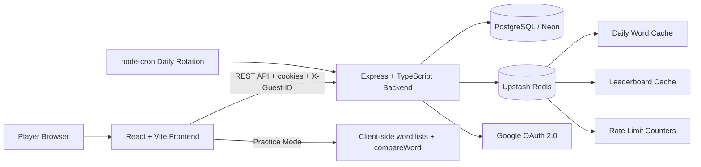

# Wordle Clone

Wordle Clone is a full-stack web application inspired by the original Wordle game. The project was built as a personal software engineering project to demonstrate end-to-end product thinking: requirements analysis, architecture design, frontend implementation, backend API design, authentication, persistence, caching, performance considerations, and automated testing.

The main goal is not only to recreate the Wordle gameplay loop, but to design it as a scalable web application with clear engineering trade-offs.

## Project Goals

- Build a complete full-stack application with a real frontend, backend, database, cache layer, authentication flow, and deployment-oriented architecture.
- Recreate the core Wordle experience: one daily puzzle, six attempts, colored feedback, virtual keyboard, win/lose states, and shareable results.
- Support low-friction guest play while preserving progress after login through guest-to-user data merging.
- Add an unlimited Practice Mode that runs entirely on the client to reduce backend load.
- Design for scalability by caching high-read data such as the daily word and leaderboard.
- Validate behavior through unit, integration, component, hook, dictionary parity, and E2E tests.

## Core Features

- **Daily Challenge**: one shared word per day for all players.
- **Practice Mode**: unlimited client-side games that do not affect daily streaks.
- **Guest Play**: users can play immediately without signing in.
- **Google OAuth Login**: authenticated users can preserve stats and streaks.
- **Guest Data Merge**: guest game history is merged into the authenticated account after login.
- **Statistics**: games played, games won, win percentage, current streak, max streak, and guess distribution.
- **Leaderboard**: public top-player ranking based on streak performance.
- **Offline Sync Retry**: daily progress can be stored locally and retried when the browser comes back online.
- **Responsive UI**: playable game board, virtual keyboard, modals, toast feedback, and mode switching.

## Architecture Overview

The application is split into two main repositories inside the project:

- `backend`: Express + TypeScript API server.
- `frontend`: React + Vite single-page application.

## Key Architecture Decisions

| Decision | Description | Reasoning |
|---|---|---|
| Shared daily word | All users receive the same word each day | Creates a social/shared experience and reduces backend complexity |
| Redis-backed daily word | The selected daily word is cached after being stored in PostgreSQL | Reduces database reads for the highest-traffic endpoint |
| Guest-first experience | A guest UUID is stored locally and sent with API requests | Removes sign-up friction while still allowing progress tracking |
| Guest-to-user merge | Guest games are transferred after OAuth login | Preserves player history and recalculates streaks safely |
| Client-side Practice Mode | Practice games use bundled word lists and local validation | Avoids unnecessary backend traffic for a mode that does not affect stats |
| Client-side guess comparison | The frontend computes tile colors after loading the daily word | Provides instant feedback and avoids one API request per guess |
| Background sync | Daily guesses are synced after local UI updates | Keeps the UI fast while still persisting progress |

Security trade-off: the daily word is delivered to the client in Base64 form, which is encoding rather than encryption. This is acceptable for the scope of this personal/academic project because it prioritizes responsiveness and architectural simplicity. A production anti-cheat version would move guess validation back to the server.

## Tech Stack

| Layer | Technology |
|---|---|
| Frontend | React 19, Vite 7, JSX, Axios |
| Backend | Node.js, Express 5, TypeScript |
| Database | PostgreSQL, Prisma 6 |
| Cache | Upstash Redis |
| Authentication | Google OAuth 2.0, JWT, httpOnly cookies |
| Scheduling | node-cron |
| Testing | Vitest, Supertest, React Testing Library, Cypress |
| Deployment target | Vercel, Railway, Neon, Upstash |

## Main Application Flows

### Daily Game Flow

1. A scheduled cron task selects the daily word.
2. The backend stores the word in PostgreSQL and caches it in Redis.
3. The frontend loads the daily game state from the backend.
4. The player submits guesses and receives instant client-side feedback.
5. The frontend syncs progress to the backend.
6. When the game ends, the backend updates streak-related statistics.

### Practice Mode Flow

1. The frontend selects a random practice word from a bundled answer list.
2. Guesses are validated against a local dictionary.
3. Tile feedback is computed in the browser.
4. No backend call, database write, Redis write, or streak update is needed.

### Guest Merge Flow

1. A guest player is identified by a locally stored UUID.
2. The guest can play daily games without signing in.
3. After Google OAuth login, the frontend requests a guest merge.
4. The backend transfers non-conflicting guest games to the user account.
5. The backend recalculates current streak and max streak from consolidated history.

## Backend Design

The backend is organized by feature modules:

- `auth`: Google OAuth, JWT token lifecycle, refresh rotation, logout, current profile, and guest merge.
- `game`: daily game loading, game state sync, daily word retrieval, and streak calculation.
- `stats`: personal statistics and leaderboard.
- `perf`: internal performance and cache metrics.
- `middleware`: authentication identity, rate limiting, validation, request timing, and error handling.
- `lib`: Prisma client, Redis client, cron service, and cache metrics.

Core persistence models:

- `User`
- `DailyWord`
- `DailyGame`
- `DailyGuess`
- `WordBank`

## Frontend Design

The frontend is built around reusable components and custom hooks:

- `useGame`: daily game state machine, sync, offline restore, and keyboard/tile state.
- `usePractice`: client-side practice game state machine.
- `useAuth`: Google login, logout, profile loading, and guest merge handling.
- `useStats`: authenticated player statistics.
- `compareWord`: pure word comparison engine with duplicate-letter handling.
- UI components: board, rows, cells, keyboard, header, mode switch, modals, toast, stats, leaderboard, and share button.

This separation keeps gameplay logic testable while allowing the UI to remain focused on rendering and interaction.

## API Surface

| Method | Endpoint | Purpose |
|---|---|---|
| `GET` | `/api/game/today` | Load the current daily game |
| `POST` | `/api/game/sync` | Sync daily guesses and status |
| `POST` | `/api/auth/google` | Exchange Google OAuth code for an app session |
| `POST` | `/api/auth/refresh` | Rotate access/refresh tokens |
| `POST` | `/api/auth/merge` | Merge guest progress into an authenticated account |
| `POST` | `/api/auth/logout` | Revoke session |
| `GET` | `/api/auth/me` | Load current user profile |
| `GET` | `/api/stats/me` | Load personal statistics |
| `GET` | `/api/leaderboard` | Load public leaderboard |
| `GET` | `/health`, `/health/live`, `/health/ready` | Health and readiness checks |

## Quality And Testing

The project includes multiple testing layers:

- Unit tests for pure logic such as word comparison and streak calculation.
- Backend integration tests for daily game loading, game completion, sync behavior, auth merge, and guest data handling.
- Frontend component and hook tests for gameplay and UI behavior.
- Dictionary parity checks to ensure frontend and backend word data stay aligned.
- Cypress E2E tests for daily and practice gameplay flows.

## Current Result

The project currently delivers a complete playable Wordle-style experience with both daily and practice modes. Players can start as guests, complete the daily challenge, continue playing in practice mode, sign in with Google, preserve progress, view personal statistics, and compare streak performance on a leaderboard.

From an engineering perspective, the application demonstrates:

- A modular full-stack architecture with separate frontend and backend applications.
- A production-oriented backend using Express, TypeScript, Prisma, PostgreSQL, Redis, authentication middleware, validation middleware, rate limiting, and health checks.
- A responsive React frontend with reusable components, custom hooks, local gameplay logic, optimistic UI updates, offline retry behavior, and lazy-loaded modals.
- A persistence model that supports users, guest games, daily words, guesses, word banks, streaks, and leaderboard data.
- A cache strategy for high-read data such as the daily word and leaderboard.
- A guest-to-authenticated-user merge flow that preserves progress and recalculates streaks.
- Test coverage across core logic, backend integration behavior, frontend hooks/components, dictionary consistency, and end-to-end gameplay flows.

This project is intended as a portfolio-ready personal project that demonstrates practical full-stack engineering, architecture trade-off analysis, and maintainable implementation across both frontend and backend.
